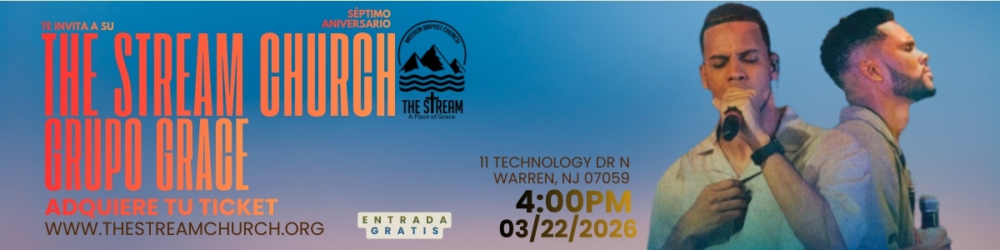
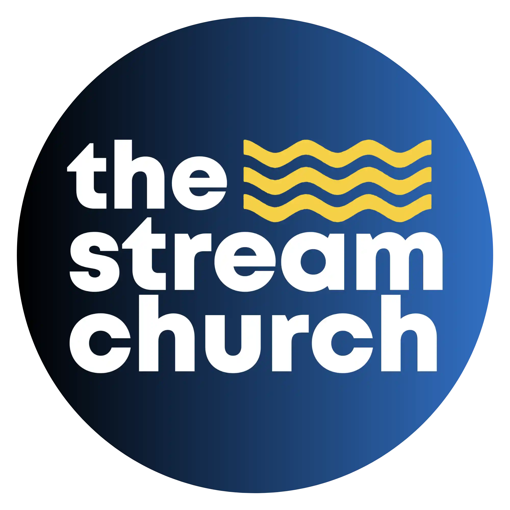

  

<h1 align="center">The Stream Church Website</h1>

  Public website for <strong>Mission Baptist Church: The Stream</strong>, serving the Spanish-speaking community in Warren, New Jersey.

  
  
  

## Live Links

- Live website: [thestreamchurch.org](https://thestreamchurch.org)
- GitHub Pages preview: [titosoriano.github.io/thestreamchurchweb](https://titosoriano.github.io/thestreamchurchweb/)
- Repository: [github.com/titosoriano/thestreamchurchweb](https://github.com/titosoriano/thestreamchurchweb)

## About This Project

This project is a custom multi-page church website built to give The Stream Church a clear, welcoming, and mobile-friendly digital presence. It combines church information, ministry pages, downloadable biblical resources, and media-rich storytelling into a site that helps new visitors explore the church and helps members stay connected.

From a portfolio perspective, this project highlights front-end execution for a real organization, including responsive layout work, content architecture, media integration, and deployment through GitHub Pages alongside a live production domain.

## Preview

  

  Visit the preview site here: 
  <strong><a href="https://titosoriano.github.io/thestreamchurchweb/">titosoriano.github.io/thestreamchurchweb</a></strong>

## Key Features

- Responsive multi-page website built with HTML, CSS, and JavaScript
- Custom navigation, shared components, and reusable layout sections
- Embedded image, video, audio, and PDF content
- Spanish-language ministry and church content for community accessibility
- Separate GitHub Pages preview and production custom domain deployment
- Resource pages for faith, teaching, and church outreach

## Pages Included

- Home
- Mission and Vision
- What to Expect
- Our Pastors
- Offerings
- Missions and Outreach
- Grace Foundation
- Confession of Faith
- Baptist Catechism
- Tribute page for Pastor Santos Sandoval

## Built With

- HTML5
- CSS3
- JavaScript
- GitHub Pages

## Why This Project Matters

The goal of this website is to provide an accessible digital home for The Stream Church, helping visitors learn about the church, explore ministries, access biblical resources, and connect with the congregation online. It is both a practical ministry tool and a strong example of real-world front-end website delivery.

## Author

Created and maintained by Santos Soriano.
